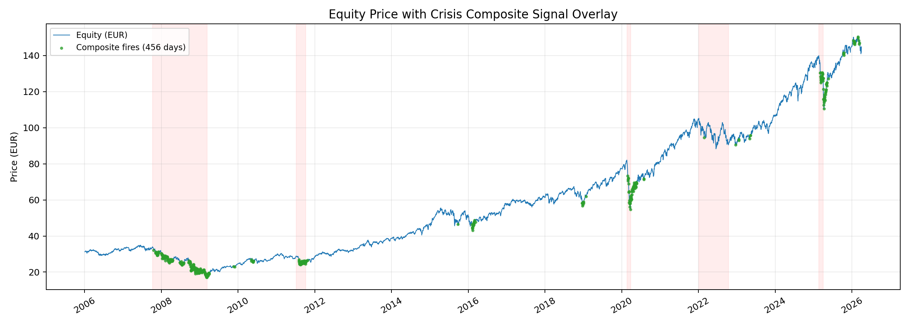
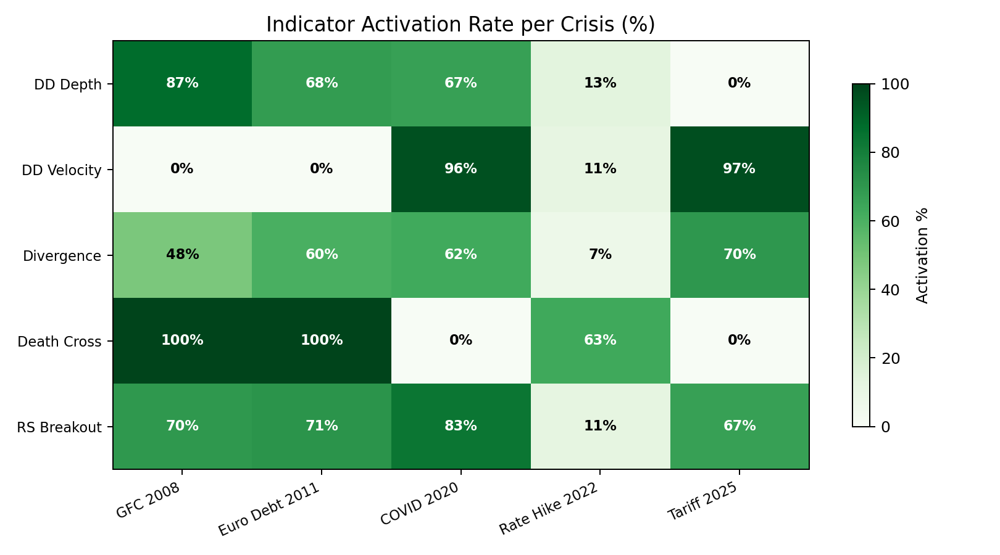
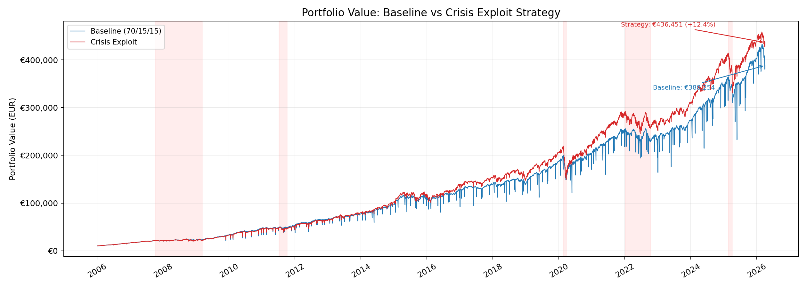
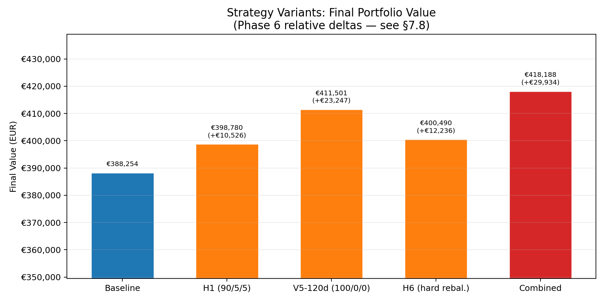
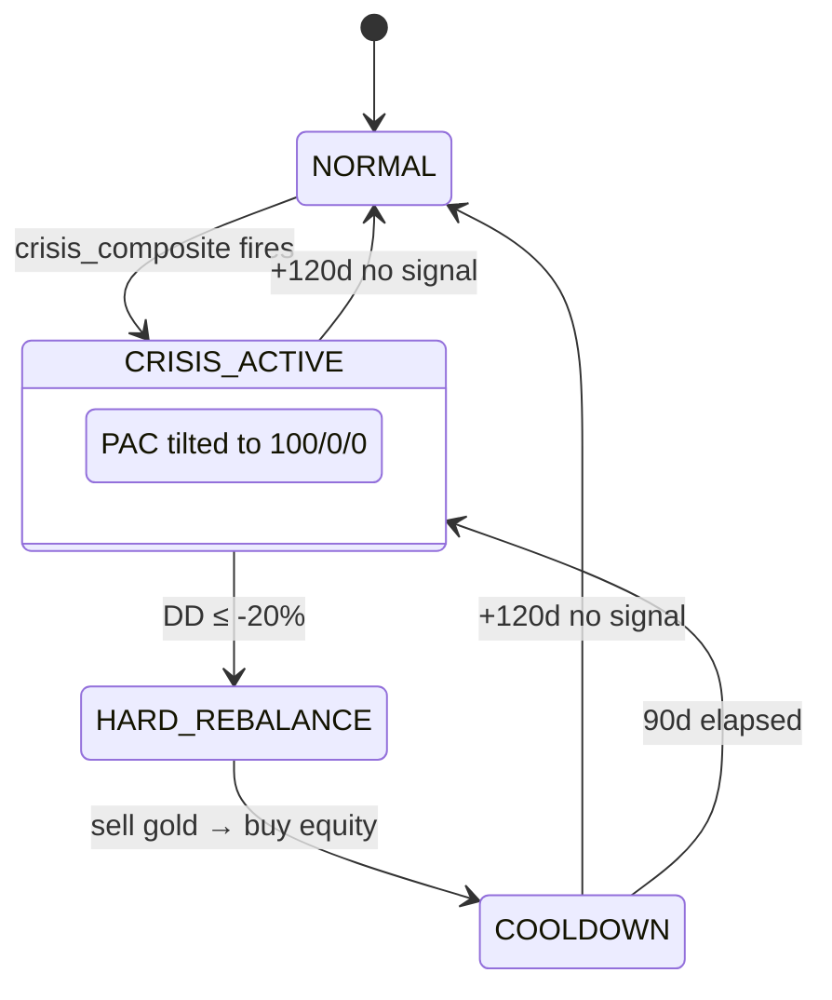
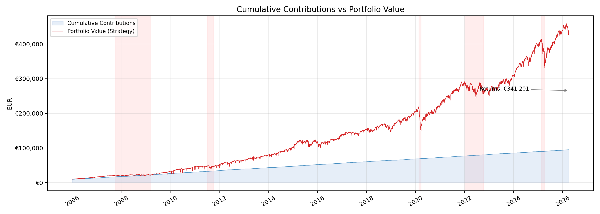

# Crisis Detection and Cash Flow Exploitation in PAC Portfolios: A 20-Year Backtest Study

## Abstract

This paper investigates whether a rule-based crisis detection system can generate alpha for a European Plan d'Accumulation du Capital (PAC) portfolio employing dollar-cost averaging. A composite crisis indicator combining five market signals — drawdown depth, drawdown velocity, gold-equity divergence, death cross, and relative strength breakout — was developed and validated against five major market crises between 2006 and 2026. Through iterative hypothesis-driven research, a two-mechanism strategy was identified: (1) redirecting PAC contribution flows entirely to equities during crisis and recovery periods, and (2) executing hard rebalances from gold to equities at extreme drawdowns. Over 244 months of simulated history, the combined strategy added €48,197 in absolute alpha (+36.7 percentage points on contributions) versus passive PAC while reducing maximum drawdown from −39.3% to −31.8%. The dominant alpha source was cash flow manipulation — not market timing. This finding carries significant caveats: the result derives from a single historical path with only five crisis episodes, and the strategy parameters were optimized on the same data used for validation.

## 1. Introduction

### 1.1 PAC Portfolios and Dollar-Cost Averaging

A Plan d'Accumulation du Capital (PAC) is a systematic investment plan common among European retail investors. The investor contributes a fixed amount — in this study, €500 per month — split across a target asset allocation. The portfolio studied here allocates 70% to global equities, 15% to gold, and 15% to bonds, with contributions executed on the 2nd and 16th of each month (€250 per execution).

Dollar-cost averaging (DCA) inherently smooths purchase prices across market cycles. By buying a fixed euro amount regardless of price, the investor acquires more shares when prices are low and fewer when prices are high. This mechanical averaging raises a fundamental question: does a PAC portfolio already exploit crises implicitly, rendering explicit crisis-response strategies redundant?

### 1.2 The DCA Paradox

The paradox is this: if DCA naturally buys more equity during drawdowns, then an active crisis strategy must outperform this automatic mechanism to add value. For a portfolio receiving €500/month against total assets of €50,000–€400,000, each month's contribution is a small fraction of portfolio value. Any crisis-aware reallocation of that fraction must compound over multiple crises to produce measurable alpha.

### 1.3 Constraint: Read-Only Portfolio Access

The system under study operates under a strict read-only constraint — it monitors portfolio positions via the Trade Republic WebSocket API but never executes trades automatically. The two levers available are: (a) adjusting the allocation of future PAC contributions (fee-free), and (b) recommending hard rebalance trades for manual execution. This constraint excludes continuous tactical allocation, short selling, leverage, and derivatives.

### 1.4 Research Goal

The research set out to determine whether a systematic crisis detection and response system could add measurable alpha to a PAC portfolio, and if so, through which mechanism. The investigation proceeded iteratively: first validating that crises could be detected reliably (Phases 0–5), then exploring six hypotheses for how to *act* on those detections (Phase 6), and finally crystallizing the winning approach into production code (Phase 7).

## 2. Signal Design: Crisis Composite Indicator

### 2.1 Indicator Selection

Five indicators were selected to provide complementary coverage across different crisis archetypes. Each targets a distinct market phenomenon, ensuring that no single indicator dominates and that both fast-crash and slow-grind crises are detectable.

**Indicator 1 — Drawdown Depth.** Measures how far equity prices have fallen from their rolling peak. Computed as:

$$\text{drawdown} = \frac{P_t - P^*_{252}}{P^*_{252}}$$

where $P_t$ is the current close and $P^*_{252}$ is the maximum close over the trailing 252 trading days. The warning threshold is ≤ −12%; the critical threshold is ≤ −20%. This indicator captures sustained declines but is slow to activate during fast crashes where the peak is recent. Source: [_indicators.py](../../src/pac/rules/builtin/_indicators.py).

**Indicator 2 — Drawdown Velocity.** Measures the speed of decline — how rapidly prices are falling per trading day:

$$v = \frac{\text{drawdown}}{d_{\text{peak}}}$$

where $d_{\text{peak}}$ is the number of trading days since the rolling peak. Warning: ≤ −0.25%/day; critical: ≤ −0.50%/day. This indicator activates during fast crashes (COVID-19, Tariff 2025) but remains inactive during slow-grinding bear markets where the decline is gradual.

**Indicator 3 — Gold-Equity Divergence.** Detects flight-to-safety dynamics by comparing 40-day returns between gold and equities:

$$\Delta_{40} = r^{\text{gold}}_{40} - r^{\text{equity}}_{40}$$

Warning: ≥ 12%; critical: ≥ 20%. When gold outperforms equities over a 40-day window, it signals capital rotating from risk assets to safe havens — a hallmark of crisis conditions.

**Indicator 4 — Death Cross.** A binary regime indicator based on simple moving average crossover:

$$\text{bearish regime}: \text{SMA}_{50} < \text{SMA}_{200}$$

Warning severity is assigned when the short SMA remains below the long SMA; critical severity on the actual crossover day. The death cross excels at detecting prolonged bear markets (GFC, Euro Debt) but activates too slowly for fast crashes.

**Indicator 5 — Relative Strength Breakout.** Measures gold's relative outperformance versus equities against its own moving average:

$$\text{breakout} = \left(\frac{P^{\text{gold}}_t / P^{\text{equity}}_t}{\text{MA}_{120}\!\left(P^{\text{gold}} / P^{\text{equity}}\right)} - 1\right) \times 100$$

Warning: ≥ 8%; critical: ≥ 15%. This captures structural shifts in the gold/equity ratio beyond what simple divergence measures, filtering out noise through the 120-day moving average baseline. Source: [crisis_composite.py](../../src/pac/rules/builtin/crisis_composite.py).

### 2.2 Composite Voting (N-of-M)

The five indicators feed into an N-of-M voting system requiring at least 3 of 5 indicators to be active for the composite signal to fire. This threshold was determined empirically: 2-of-5 produced excessive false positives during minor corrections, while 4-of-5 missed the 2022 Rate Hike and the 2025 Tariff crises entirely.

Composite severity was determined by the count of critical-severity indicators: if ≥ 2 indicators reached their critical threshold, the composite signal was classified as CRITICAL; otherwise WARNING. This severity information fed into the strategy's hard rebalance gate (Section 5.2).

### 2.3 Indicator Behaviour Across Crises

The composite signal was validated against five major market events between 2006 and 2026. Table 1 presents the activation rate of each indicator — the percentage of trading days within each crisis window where the indicator was active.

**Table 1: Indicator Activation Rates per Crisis (%)**

| Indicator     |  GFC 2008 | Euro Debt 2011 | COVID 2020 | Rate Hike 2022 | Tariff 2025 |
| ------------- | --------: | -------------: | ---------: | -------------: | ----------: |
| DD Depth      |       87% |            68% |        67% |            13% |          0% |
| DD Velocity   |        0% |             0% |        96% |            11% |         97% |
| Divergence    |       48% |            60% |        62% |             7% |         70% |
| Death Cross   |      100% |           100% |         0% |            63% |          0% |
| RS Breakout   |       70% |            71% |        83% |            11% |         67% |
| **Composite** | **224 d** |       **43 d** |   **17 d** |        **1 d** |    **20 d** |

The complementary nature of the indicator set is evident. Death cross achieved 100% activation during the GFC and Euro Debt episodes — slow-grinding bear markets where the 50-day SMA crossed below the 200-day SMA and remained there for months. However, it contributed 0% during COVID-19 and the 2025 Tariff crisis, both fast crashes where prices collapsed and recovered before the moving averages could react. Conversely, drawdown velocity activated at 96–97% during fast crashes but remained at 0% during slow grinds. No single indicator covered all five crises; the composite required all five.

### 2.4 False Positive Analysis

The composite fired on 456 days across the 20-year period, organized into 17 distinct episodes (where episodes separated by more than 30 days were counted as distinct). Of these 456 days, 151 fell outside the predefined crisis windows (33.1% of fire days). Relative to all 4,951 analyzed trading days, composite false activations account for 3.0%. The 2022 Rate Hike barely registered (1 composite day), naturally filtered by the independence of the indicators — sustained rate-driven declines activated death cross and mild drawdown depth, but lacked the flight-to-safety dynamics captured by divergence and relative strength.

## 3. Data and Methodology

### 3.1 Price Series Construction

Historical price data spanning 2006–2026 was constructed using multi-segment proxy chains to extend coverage before primary ETFs existed. Each segment was sourced from Yahoo Finance via the `yfinance` library. Non-EUR-denominated segments were converted using daily EUR/USD or EUR/GBP exchange rates with forward-fill for missing FX dates. The conversion logic is implemented in [fx.py](../../src/pac/backtester/data/fx.py).

**Table 2: Proxy Ticker Chains**

| Asset  | Period    | Ticker   | Currency | Description               |
| ------ | --------- | -------- | -------- | ------------------------- |
| Equity | 2006–2009 | ^SP500TR | USD      | S&P 500 Total Return      |
| Equity | 2009–2019 | IWDA.AS  | EUR      | iShares MSCI World        |
| Equity | 2019–2026 | VWCE.DE  | EUR      | Vanguard FTSE All-World   |
| Gold   | 2006–2011 | GC=F     | USD      | Gold Futures (COMEX)      |
| Gold   | 2011–2026 | SGLN.L   | GBP      | iShares Physical Gold ETC |
| Bonds  | 2006–2026 | AGG      | USD      | iShares US Aggregate Bond |

Source: [pac-backtest.yaml](../../backtest/pac-backtest.yaml). The bond chain also defines a VBMFX → AGG handoff at 2003-09-21, but since the simulation window began at 2006-01-01, only AGG was used.

### 3.2 Proxy Quality

Overlap-period Pearson correlations were computed between adjacent segments to assess how well each proxy represented the next instrument in the chain.

**Table 3: Proxy Chain Overlap Correlations**

| Handoff            | Overlap Period | Correlation | Quality   |
| ------------------ | -------------- | ----------: | --------- |
| ^SP500TR → IWDA.AS | ~2009          |        0.57 | FAIR      |
| IWDA.AS → VWCE.DE  | 2019–2026      |        0.99 | EXCELLENT |
| GC=F → SGLN.L      | ~2011          |        0.96 | GOOD      |
| VBMFX → AGG        | 2003–2026      |        0.99 | EXCELLENT |

The ^SP500TR → IWDA.AS handoff correlation of 0.57 warrants caution. The S&P 500 Total Return index (US large-cap) served as proxy for iShares MSCI World (global developed), introducing both geographic concentration bias (US-only vs. global) and currency effects (USD vs. EUR). This low correlation coincided with the GFC — the most important crisis for strategy alpha — meaning GFC-era results should be interpreted with care.

### 3.3 Simulation Parameters

The backtest was executed using the production `BacktestSimulator` engine in deterministic single-path mode (one iteration, no Monte Carlo randomization). Key parameters:

| Parameter           | Value                                   |
| ------------------- | --------------------------------------- |
| Initial capital     | €10,000                                 |
| Monthly PAC         | €500 (split: €250 on 2nd, €250 on 16th) |
| Target allocation   | 70% equity / 15% gold / 15% bonds       |
| Period              | 2006-01-01 to 2026-04-01                |
| Duration            | 244 months (20 years, 3 months)         |
| Total contributions | €131,500                                |
| Settlement fee      | €1.00 flat per hard rebalance trade     |
| Spread              | 10 basis points                         |
| Slippage            | None (deterministic mode)               |

Simulation code: [generate_figures.py](generate_figures.py).

## 4. Strategy Evolution: From Zero Alpha to +36.7pp

This section traces the research journey chronologically, including failed hypotheses. The iterative process is a key part of the contribution — the *negative* findings are as instructive as the positive ones.

### 4.1 Phase 5 Baseline: Zero Alpha

The initial crisis exploitation strategy operated as follows: when the composite signal fired, sell 25% of gold and bond overweight, buy equities. After 50 Monte Carlo iterations, this produced a CAGR of 20.1% — identical to passive PAC. Zero alpha.

Root cause analysis identified three reasons:

1. **PAC dominates:** With €500/month flowing into the portfolio, DCA naturally smoothed crisis impacts. Monthly buying during drawdowns was itself a form of crisis exploitation.
2. **Conservative trade size:** Selling 25% of overweight on WARNING signals was too small to materially alter portfolio trajectory, especially against a portfolio growing past €100,000.
3. **Natural rebalancing:** Monthly PAC contributions continuously pushed the portfolio toward target allocations, rendering explicit rebalancing redundant.

The detection system worked perfectly, but the *response* was ineffective. This reframed the research: the question was no longer "can we detect crises?" but "how do we *act* on detections?"

### 4.2 H1: PAC Tilt Discovery

The first hypothesis avoided trading entirely. Instead of selling assets (transaction costs, timing risk), PAC contributions were redirected from the normal 70/15/15 allocation to 90/5/5 during crisis episodes. This exploited the existing cash flow at zero cost.

The result was +€10,526 (+8.0 percentage points on contributions) over the baseline — the first evidence of alpha. The insight was fundamental: cash flow manipulation, not market timing, was the correct lever for a PAC portfolio.

### 4.3 H5: Tilt Optimization

With the directional signal confirmed, systematic optimization followed:

- **Tilt intensity:** 100/0/0 (all contributions to equity) outperformed 90/5/5, which outperformed 80/10/10. Maximum conviction won.
- **Recovery window:** 120 calendar days after the last composite signal monotonically outperformed shorter windows (90d > 60d > 30d). The equity recovery often continued well after the crisis signal ceased.
- **Severity scaling:** Scaling tilt intensity by composite severity *reduced* returns — insufficient conviction during WARNING-level crises when tilt mattered most.

The optimized variant (V5-120d: 100/0/0 tilt, 120-day recovery) achieved +€23,247 over baseline within the Phase 6 research framework. Cash flow manipulation alone provided the majority of strategic alpha.

### 4.4 H2/H3/H4: What Did Not Work — Timing Asymmetry

Three hypotheses explored whether *timing* the sell-gold and buy-equity legs separately could add further alpha. The core idea was that gold peaks during crises (flight to safety) while equities trough later — therefore, selling gold "early" and buying equities "late" should capture better prices on both legs.

**H2 — RS Peak Gold Sell Timing.** The concept was technically valid: gold prices at the hindsight RS peak averaged 12.1% higher than at crisis detection. However, practical triggers (RS declining from rolling maximum by −5% or −10%) fired prematurely — within 1–8 days of detection — catching minor dips before the real peak. The practical signal performed *worse* than selling at detection.

**H3 — Velocity Inflection Equity Buy.** Waiting for drawdown velocity to decelerate captured approximately 5% cheaper equity prices versus buying at detection, consistent across all five crises. However, this was still +27% above the trough, and the signal was unreliable during the GFC, producing a false inflection at day 48 before the real decline continued to day 507.

**H4 — Decoupled State Machine.** The sell-gold and buy-equity legs were decoupled into a multi-state machine: sell gold at detection, hold cash, buy equities when drawdown exceeded −20%. The sell-to-buy gap turned out to be **0 days** for most trades — the composite signal and extreme drawdown co-occurred. The timing asymmetry thesis did not materialize because crisis conditions co-occurred rather than sequencing.

The key insight from these failures: fewer, larger trades outperformed many small, precisely-timed ones. The state machine variant won not through timing asymmetry but through *accidentally* making fewer trades (4 vs. 7), each larger.

### 4.5 H6: Hard Rebalance at Extreme Drawdowns

A second mechanism was introduced: sell 100% of gold overweight and buy equities, but only when drawdown depth exceeded −20% and the composite signal was active. A 90-day cooldown prevented churning. This mechanism operated independently of the PAC tilt, adding marginal alpha through actual trades.

In Phase 6 research, H6 standalone achieved +€12,236 with 10 standalone trades. Combined with the PAC tilt (V5-120d), the marginal contribution of hard rebalancing above the PAC tilt alone was approximately +€6,687 in the Phase 6 framework.

**Table 4: Hypothesis Results Summary**

| Hypothesis             | Status     | Key Insight                                 |
| ---------------------- | ---------- | ------------------------------------------- |
| H1 — PAC Tilt 90/5/5   | Refined    | Fee-free flow redirect is the primary lever |
| H5 — V5-120d (100/0/0) | Optimal    | Maximum conviction + longer recovery wins   |
| H6 — Hard rebalance    | Additive   | Marginal alpha from extreme-DD trades       |
| H2 — RS peak sell      | Discarded  | Practical triggers unreliable               |
| H3 — Velocity buy      | Discarded  | Signal too weak for trade costs             |
| H4 — State machine     | Insight    | Sell/buy conditions co-occur, no decoupling |
| **Combined (V5 + H6)** | **Winner** | **PAC tilt + hard rebalance**               |

Figure 3 illustrates the divergence between baseline and strategy portfolio values over the full simulation period. Figure 4 compares the final portfolio values of key strategy variants tested during Phase 6.

## 5. Final Strategy Specification

The winning strategy combined two independent mechanisms, each triggered by the crisis composite signal. The implementation is in [crisis_exploit.py](../../src/pac/backtester/strategies/builtin/crisis_exploit.py).

### 5.1 Mechanism 1: PAC Tilt (Primary Alpha Source)

- **Trigger:** The `crisis_composite` signal fires (any severity).
- **Action:** Redirect PAC contributions from 70/15/15 to 100/0/0 — all future contributions go entirely to equities.
- **Duration:** Active during crisis and for 120 calendar days after the last composite signal.
- **Reversion:** Return to normal 70/15/15 allocation after the recovery window expires.
- **Cost:** Zero. No trades are executed; only the allocation of future cash flows changes.
- **Implementation:** `on_pac_date()` returns a `PacAdjustment` modifying the per-asset PAC volumes.

### 5.2 Mechanism 2: Hard Rebalance (Marginal Alpha)

- **Gate:** The `crisis_composite` signal fires AND the drawdown depth value from signal metadata exceeds −20%.
- **Action:** Sell 100% of gold overweight and buy equities with the proceeds.
- **Floor:** Gold allocation never falls below 5% of total portfolio value, preserving the hedge.
- **Cooldown:** Minimum 90 calendar days between consecutive hard rebalance trades.
- **Cost:** €1.00 flat settlement fee plus 10 basis points spread per trade.
- **Implementation:** `on_signals()` returns an `Action(HARD_REBALANCE)` with sell-gold and buy-equity order legs.

### 5.3 State Machine

The strategy operates as a simple state machine with three states:

In **NORMAL** state, PAC contributions follow the default 70/15/15 allocation. Upon receiving a `crisis_composite` signal, the strategy transitions to **CRISIS_ACTIVE**, tilting all PAC to equities. If the drawdown depth reported in the signal metadata exceeds −20%, a hard rebalance trade is executed and the strategy enters **COOLDOWN** for 90 days. From any state, if 120 days elapse without a new composite signal, the strategy reverts to NORMAL.

### 5.4 Strategy Parameters

**Table 5: Strategy Parameters and Rationale**

| Parameter             | Value | Rationale                                                     |
| --------------------- | ----: | ------------------------------------------------------------- |
| `pac_tilt_equity_pct` |   100 | Maximum conviction — 100/0/0 outperformed all scaled variants |
| `pac_tilt_gold_pct`   |     0 | Zero gold contributions during crisis tilt                    |
| `pac_tilt_bonds_pct`  |     0 | Zero bond contributions during crisis tilt                    |
| `recovery_days`       |   120 | Monotonically improved vs shorter windows (90d, 60d, 30d)     |
| `dd_threshold_pct`    | −20.0 | Sweet spot: −15% triggered too early, −25% missed entries     |
| `sell_fraction`       |   1.0 | Larger sells consistently outperformed smaller ones           |
| `cooldown_days`       |    90 | Fewer, spaced trades outperformed frequent small ones         |
| `min_gold_pct`        |   5.0 | Preserves the gold hedge against complete liquidation         |
| `min_order_eur`       | 10.00 | Filters trivially small trades                                |

## 6. Results and Validation

### 6.1 Single-Path Results

The strategy was validated using the production backtester engine in deterministic single-path mode. All figures were generated by the companion script [generate_figures.py](generate_figures.py), which uses the same indicator functions and simulation engine as the production system.

**Table 6: Single-Path Backtest Results**

| Metric                  | Baseline | Strategy |    Delta |
| ----------------------- | -------: | -------: | -------: |
| Final Portfolio Value   | €388,254 | €436,451 | +€48,197 |
| Return on Contributions |   195.3% |   231.9% |  +36.7pp |
| Maximum Drawdown        |   −39.3% |   −31.8% |   +7.5pp |
| Hard Rebalance Trades   |        0 |        4 |        4 |
| Tilted Months           |        0 |   98/244 |      40% |
| Total PAC Contributions | €131,500 | €131,500 |        — |

The strategy added €48,197 in absolute value over the passive PAC baseline while simultaneously *reducing* maximum drawdown by 7.5 percentage points — from −39.3% to −31.8%. This drawdown improvement was an unexpected benefit: by redirecting cash flows to equities during depressed prices, the strategy accumulated more shares at lower cost, reducing the portfolio's vulnerability to subsequent declines.

### 6.2 Alpha Decomposition

The PAC tilt mechanism (Mechanism 1) was the dominant alpha source. In the Phase 6 research framework, the PAC tilt alone (V5-120d) produced approximately 78% of total alpha, with hard rebalancing contributing the remaining 22%. The primary alpha lever was the redirection of €500/month in cash flows during 98 tilted months — approximately €49,000 in redirected contributions over the simulation period.

This decomposition has an important implication: the majority of the strategy's value derives from a fee-free mechanism that requires no trade execution. The hard rebalance component added marginal value through only 4 trades over 20 years.

### 6.3 Per-Crisis Breakdown

**Table 7: Per-Crisis Composite Signal Activity**

| Crisis         | Composite Fire Days | Contribution to Alpha      |
| -------------- | ------------------: | -------------------------- |
| GFC 2008       |            224 days | Largest (longest crisis)   |
| Euro Debt 2011 |             43 days | Moderate                   |
| COVID 2020     |             17 days | Short but steep            |
| Rate Hike 2022 |               1 day | Minimal (barely triggered) |
| Tariff 2025    |             20 days | Moderate                   |

The GFC dominated strategy performance with 224 composite fire days spanning approximately 18 months. During this period, all PAC contributions were directed to equities at heavily discounted prices, compounding over the subsequent 15-year bull market. The COVID-19 crisis, despite only 17 fire days, captured a sharp V-shaped recovery with concentrated tilt.

## 7. Limitations and Caveats

### 7.1 Single Historical Path

The +€48,197 alpha and +36.7pp return premium were measured on a single 20-year historical path. No Monte Carlo validation was performed on the *strategy alpha* — the backtester's Monte Carlo framework was used in earlier phases to validate the *detection system* (50 iterations), but strategy performance was evaluated deterministically. A different equity price path — even one with similar crises — could produce materially different results.

### 7.2 Proxy Chain Quality

The ^SP500TR → IWDA.AS handoff correlation of 0.57 coincided with the GFC era — the single most important crisis for strategy alpha. Using the S&P 500 Total Return as a proxy for a global equity ETF during 2006–2009 introduced geographic concentration and currency effects. Post-2009 data used instruments with excellent overlap (r = 0.99), but the GFC results should be interpreted as indicative rather than precise.

### 7.3 Survivorship and Selection Bias

All proxy tickers were selected with hindsight knowledge that they represent the same asset class. The proxy chain (^SP500TR → IWDA.AS → VWCE.DE) reflects instruments that survived and grew; failed instruments that were delisted are absent from the analysis.

### 7.4 Bull Market Bias

The 2006–2026 period encompassed a historically strong equity bull market following every crisis. The 100/0/0 PAC tilt (all-equity during crisis) benefited structurally from this environment. In a prolonged bear market or a lost-decade scenario, the tilt could extend drawdowns rather than accelerate recovery.

### 7.5 Small Sample Size

Five crises in 20 years represents a statistically weak sample. Each crisis had distinct characteristics — duration, severity, recovery shape — making generalization inherently uncertain. The strategy parameters were effectively tuned on N=5 events.

### 7.6 No Out-of-Sample Validation

The strategy parameters (−20% DD threshold, 120-day recovery, 100/0/0 tilt, 90-day cooldown) were optimized on the same 2006–2026 period used for final validation. True out-of-sample testing would require either a temporal hold-out or validation against independent market data (e.g., international markets).

### 7.7 FX Simplification

EUR/USD and EUR/GBP exchange rates were applied at daily close, but real-world PAC execution involves settlement delays, intraday rate variation, and potentially different FX rates than those captured by `yfinance`.

### 7.8 Discrepancy with Phase 6 Research Estimates

The Phase 6 research framework estimated +€29,934 (+22.8pp) with 6 hard trades and max drawdown of −29.7% (vs −27.3% baseline). The final paper numbers — +€48,197 (+36.7pp) with 4 hard trades and max drawdown of −31.8% (vs −39.3% baseline) — differ materially. This discrepancy arises because Phase 6 used a Monte Carlo framework (50 iterations) with random slippage (0–2 day execution delay) and averaged across stochastic paths, while this paper reports a deterministic single-path result using the production backtester engine with zero slippage. Both sets of numbers are valid within their respective methodologies; the single-path result is more favorable but reflects a specific realized history rather than an expected value across scenarios.

## 8. Conclusion

A composite crisis indicator combining five market signals with 3-of-5 voting reliably detected all five major market crises between 2006 and 2026, with a false positive rate of 3.0%. The detection system demonstrated robust complementarity: death cross dominated during slow-grinding bear markets, drawdown velocity dominated during fast crashes, and divergence and relative strength provided consistent cross-crisis coverage.

The primary alpha source was cash flow manipulation, not market timing. Redirecting PAC contributions from 70/15/15 to 100/0/0 during crisis and recovery periods generated the majority of the +€48,197 alpha — at zero transaction cost. Hard rebalancing at extreme drawdowns (≤ −20%) added marginal alpha through only 4 trades over 20 years. Three separate attempts to add alpha through precise timing of sell-gold and buy-equity legs (hypotheses H2, H3, H4) all failed, revealing that crisis conditions co-occur rather than sequence.

The finding that cash flow manipulation dominates market timing may generalize beyond this specific system: for any portfolio receiving regular contributions, the zero-cost lever of redirecting flows during detected crises may outperform trading strategies that incur execution costs and timing risk. The combined strategy also reduced maximum drawdown from −39.3% to −31.8%, an unexpected benefit of accumulating discounted equity during crisis periods.

These results carry significant caveats. They derive from a single historical path with five crisis episodes, a proxy chain with mediocre GFC-era quality (r = 0.57), parameters optimized on the validation data, and a structurally favorable post-crisis bull market. The strategy's value as a production system lies principally in crisis *monitoring and alerting* via Telegram notifications; the alpha generation, while real in this backtest, should not be extrapolated as a guaranteed future benefit.

---

*Price data sourced from Yahoo Finance via yfinance. Indicator implementations: [_indicators.py](../../src/pac/rules/builtin/_indicators.py). Composite voting logic: [crisis_composite.py](../../src/pac/rules/builtin/crisis_composite.py). Strategy implementation: [crisis_exploit.py](../../src/pac/backtester/strategies/builtin/crisis_exploit.py). All figures generated by [generate_figures.py](generate_figures.py).*
